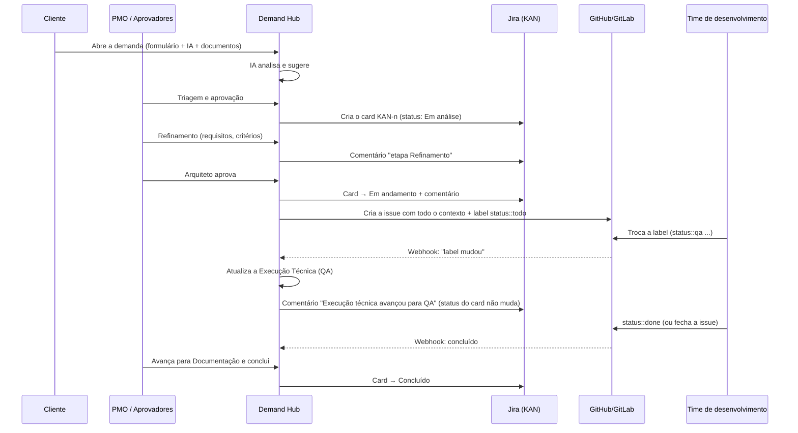

# Guia do Usuário — Demand Hub

> Um guia para aprender a usar a ferramenta do zero: o que ela faz, como rodar, como cada pessoa usa,
> e como ela conversa com o **Jira** e com o **GitHub/GitLab**.

---

## 1. O que é o Demand Hub (em uma frase)

É o **lugar único** onde uma demanda nasce, é avaliada, aprovada, detalhada, desenvolvida e entregue —
com a IA ajudando a preencher e analisar, mas **sempre com uma pessoa decidindo**.

Pense assim:

| Papel na vida real | No Demand Hub |
|---|---|
| A **recepção** que recebe o pedido | Formulário de abertura + assistente de IA |
| O **analista** que lê tudo e faz um resumo | Agentes de IA (resumo, prioridade, lacunas, duplicidade) |
| O **gerente** que decide | PMO, Diretor, Gestor, Arquiteto (aprovações) |
| O **quadro de acompanhamento** do PMO | Jira (card da demanda) |
| A **oficina** onde o sistema é construído | GitHub ou GitLab (issue técnica) |

**Regra de ouro:** o **Jira mostra a vida da demanda** (está em triagem? aprovada? em desenvolvimento?).
O **GitHub/GitLab mostra a vida do código** (em desenvolvimento? em revisão? em QA?). Um não sobrescreve o outro:
quando o código avança, o Jira **recebe um comentário**, mas o status da demanda só muda quando uma pessoa decide.

---

## 2. Como rodar a ferramenta no seu computador

Você precisa de: **Java 21**, **Maven** e **Node 20** (já instalados nesta máquina).

1. Confira o arquivo `.env` na pasta do projeto (ele guarda senhas e tokens — **nunca** envie para o GitHub).
   No mínimo ele precisa de `JWT_SECRET` e `DEV_SEED_PASSWORD`.
2. Abra um terminal na pasta do projeto e suba o **backend** (a "cozinha"):
   ```bash
   mvn -f backend/pom.xml spring-boot:run -Dspring-boot.run.profiles=dev,local
   ```
   Espere aparecer `Started DemandHubApplication`. Ele fica em `http://localhost:8080`.
3. Em outro terminal, suba o **frontend** (o "salão", a tela que você usa):
   ```bash
   npm --prefix frontend start
   ```
4. Abra **http://localhost:4200** no navegador.

> Os perfis `dev,local` usam um banco embutido (H2) na pasta `backend/data` e já criam usuários e projetos de exemplo.
> Para apagar tudo e começar do zero, pare o backend e apague a pasta `backend/data`.

### Usuários de teste

Todos usam a mesma senha: o valor de `DEV_SEED_PASSWORD` no `.env`.

| E-mail | Papel | O que essa pessoa faz |
|---|---|---|
| `cliente@demandhub.local` | Cliente | Abre e acompanha as próprias demandas |
| `pmo@demandhub.local` | PMO | Faz a triagem, classifica, aprova ou rejeita |
| `diretor@demandhub.local` | Diretor | Aprova demandas que exigem aval executivo |
| `gestor@demandhub.local` | Gestor | Aprova alocação de recursos e vê o dashboard |
| `arquiteto@demandhub.local` | Arquiteto | Analisa e aprova a arquitetura |
| `dev@demandhub.local` | Desenvolvedor | Inicia a execução técnica |
| `qa@demandhub.local` | QA | Registra validação |
| `admin@demandhub.local` | Administrador | Configura usuários, projetos, workflows e regras |

Cada pessoa só vê no menu o que o papel dela permite.

---

## 3. A jornada de uma demanda — passo a passo

Vamos acompanhar uma demanda do começo ao fim. Entre e saia com os usuários indicados.

### Passo 1 — O cliente abre a demanda (`cliente@`)
1. Menu **Nova demanda**.
2. Preencha as seções (Solicitante, Iniciativa, Impacto e prazo, Financeiro, Envolvidos, Complementos).
   Campos com `*` são obrigatórios **para enviar** — você pode salvar o rascunho incompleto.
3. Não sabe como escrever? Use a aba **Assistente** à direita: escreva, por exemplo,
   *"Quero criar uma iniciativa para automatizar o processo X"*. A IA faz perguntas e propõe valores.
4. Tem documento ou apresentação (PPT/Canva)? Aba **Documentos** → escolha o tipo → **Enviar arquivo**.
   A IA lê o conteúdo e sugere preenchimentos.
5. Aba **Sugestões**: cada sugestão mostra **origem**, **confiança** e **justificativa**. Você decide:
   **Aceitar**, **Editar e aplicar** ou **Rejeitar**. Nada entra no formulário sem a sua decisão.
   - Se o formulário diz "prazo: dezembro" e o PPT diz "outubro", aparece uma **Divergência** — você escolhe qual vale.
6. O rascunho é salvo sozinho a cada poucos segundos.
7. Clique em **Revisar e enviar** → **Enviar demanda**. Você recebe um **protocolo** (ex.: `DEM-2026-00001`).

### Passo 2 — A IA analisa (automático)
Logo após o envio, a demanda fica em **"Análise da IA"** por alguns segundos. Os agentes geram:
resumo executivo, tipo e projeto sugeridos, prioridade sugerida, impacto, complexidade, riscos,
informações faltantes e **possíveis duplicidades** (inclusive com demandas antigas importadas).
Depois a demanda vai sozinha para **"Triagem PMO"**.

### Passo 3 — O PMO faz a triagem (`pmo@`)
1. Menu **Kanban** (visão por etapa) ou **Todas as demandas** (tabela com filtros).
2. Abra a demanda. Veja:
   - **Resumo** — a visão resumida (gerada pela IA, você pode editar).
   - **Demanda completa** — tudo o que o cliente preencheu e os arquivos.
   - **Análise da IA** — a triagem completa e as **sugestões pendentes**.
3. O botão **Aprovar (PMO)** fica **bloqueado** (cadeado) enquanto faltar projeto, tipo ou prioridade.
   Resolva aceitando as sugestões da IA ou pelo botão **Classificar** (exige um motivo, que fica na auditoria).
4. Faltou informação? **Solicitar informação**: a demanda fica "Aguardando informação" e volta
   sozinha para a triagem quando o cliente responder (aba **Pendências e comentários**).
5. Tudo certo? **Aprovar (PMO)**. Não serve? **Rejeitar** (com motivo).

> **Aqui nasce o card no Jira.** Ver a seção 4.

### Passo 4 — Aprovações executivas (`diretor@` / `gestor@`)
Algumas demandas precisam de aval extra, conforme **regras configuráveis** — por exemplo:
prioridade P1, orçamento acima de R$ 500 mil ou exigência regulatória → precisa do **Diretor**.
O aprovador vê a demanda em **Aprovações** e decide. Com todas as aprovações feitas, a demanda
**avança sozinha**. Se nenhuma regra se aplica, ela passa direto.

### Passo 5 — Refinamento (`pmo@` ou `arquiteto@`)
Aba **Refinamento**:
- Registre **reuniões** com a ata/notas. Clique em **Organizar com IA**: o agente separa requisitos,
  critérios de aceite, riscos, dúvidas e decisões — você aceita o que fizer sentido.
- Adicione itens manualmente e marque dúvidas como resolvidas.
- Para avançar, é obrigatório ter **pelo menos 1 requisito funcional, 1 critério de aceite e nenhuma dúvida aberta**.
- Botão **Enviar para arquitetura**.

### Passo 6 — Arquitetura (`arquiteto@`)
- Aba **Arquitetura e prompt** → **Gerar** a proposta de arquitetura (componentes, integrações, riscos).
- Gere também a **Especificação técnica** e o **Prompt técnico** (texto pronto para usar no Claude, Claude Code ou Copilot).
- Na aba **Aprovações**, o arquiteto **Aprova**. A demanda vai para **"Pronta para desenvolvimento"**.

> **Aqui nasce a issue no GitHub/GitLab.** Ver a seção 5.

### Passo 7 — Desenvolvimento (`dev@`)
- Botão **Iniciar execução** → etapa "Em desenvolvimento".
- O time trabalha no **GitHub/GitLab** mudando as **labels** da issue: `status::development` → `status::code-review` → `status::qa` → `status::deploy` → `status::done`.
- A aba **Execução** mostra os dois mundos lado a lado: **Ciclo da Demanda (Jira)** e **Execução Técnica (GitHub)**.
- Só quando o GitHub chega em **Concluído** o botão **Avançar para documentação** é liberado.

### Passo 8 — Documentação e conclusão (`pmo@`)
- Aba **Documentação** → gere a **Documentação técnica** e a **Documentação para o cliente** (dá para editar).
- **Concluir demanda**. Ela fica somente leitura, e o card do Jira vai para "Concluído".

### Demandas que não são de desenvolvimento
Alocação de pessoas, mudança operacional, consultoria e suporte seguem fluxos próprios
(ex.: Triagem → Análise de capacidade → Aprovação do gestor → Execução operacional → Concluída)
e **nunca** criam issue no GitHub/GitLab.

---

## 4. Como a ferramenta se conecta com o Jira

### Em palavras simples
A ferramenta tem uma "chave" do seu Jira (o **token de API**). Com ela, sempre que algo importante acontece
com a demanda, ela **escreve no Jira por você**: cria o card, move de coluna e deixa comentários.

### O que acontece, quando

| Quando (na ferramenta) | O que acontece no Jira |
|---|---|
| O PMO **aprova** a demanda | **Cria o card** no projeto (no seu caso, `KAN`), tipo *Tarefa*, com título `[DEM-...] título`, descrição com resumo executivo e dados principais, labels (`demand-hub`, projeto, tipo, prioridade) e link de volta para a ferramenta |
| A demanda **muda de etapa** | O card **muda de status** conforme o mapeamento e recebe um comentário `Ciclo da demanda: etapa "..."` com o motivo |
| O PMO **muda a prioridade/projeto/tipo** | O card é atualizado (prioridade e labels) |
| O **código avança** no GitHub | O card recebe um **comentário** (ex.: *"Execução técnica avançou para QA..."*) — **o status do card não muda** |
| Alguém **comenta no Jira** *(requer webhook)* | O comentário aparece na ferramenta como comentário interno |

### O mapeamento de status (seu projeto KAN)
O seu projeto tem 4 colunas. Por isso várias etapas caem na mesma coluna (e o comentário diz qual é a etapa exata):

| Etapas da ferramenta | Coluna no Jira |
|---|---|
| Análise da IA · Triagem PMO · Aguardando informação | **Tarefas pendentes** |
| Aprovação executiva/gestor · Análise de capacidade · Refinamento · Arquitetura | **Em análise** |
| Pronta p/ desenvolvimento · Em desenvolvimento/execução · Documentação | **Em andamento** |
| Concluída · Rejeitada · Cancelada | **Concluído** |

Para mudar: **Administração → Workflows e aprovações →** lápis na etapa → **"Status no Jira"**.
Se quiser colunas mais detalhadas (Triagem, Aprovação, Refinamento...), crie-as no Jira e ajuste aqui.

### Configuração (arquivo `.env`)
```
JIRA_MODE=real            # real | mock (simulado) | disabled
JIRA_URL=https://lanacarolinesribeiro.atlassian.net
JIRA_PROJECT=KAN
JIRA_ISSUE_TYPE=Tarefa
JIRA_USER_EMAIL=lana.carolinesribeiro@gmail.com
JIRA_API_TOKEN=...        # gerado em id.atlassian.com → Segurança → Tokens de API
```
Cada projeto da ferramenta pode apontar para outro projeto Jira em **Administração → Projetos**.

### Se der erro
A aba **Execução** da demanda mostra **Sincronização: OK** ou **FAILED** com a mensagem do Jira.
Corrija (token vencido, projeto errado...) e clique em **Sincronizar/reprocessar Jira**.
Uma falha no Jira **nunca trava** a demanda na ferramenta.

---

## 5. Do Jira para o Git — como uma demanda vira código

### O ponto mais importante
**O Jira e o GitHub não conversam diretamente.** Quem faz a ponte é o Demand Hub:
ele recebe as informações de um lado e repassa para o outro, mantendo cada um no seu papel.



### Passo a passo detalhado
1. **Gatilho:** a demanda técnica entra na etapa **"Pronta para desenvolvimento"** (logo depois da aprovação do arquiteto).
2. **O Demand Hub cria a issue** no repositório configurado (`SCM_PROVIDER=github` + `GITHUB_REPOSITORY=dono/repositorio`,
   ou o repositório definido no projeto). A issue leva:
   - Título `[DEM-2026-00001] título da demanda`
   - Contexto, objetivo, requisitos e critérios de aceite do refinamento
   - Decisões de negócio e de arquitetura e a proposta de arquitetura
   - O **link do card do Jira** e o **prompt técnico** (se gerado)
   - Labels `demand-hub` e `status::todo`
3. **O card entra no board** [Demand Hub — Execução técnica](https://github.com/users/Lana-Ribeiro/projects/3),
   na coluna **A fazer**.
4. **O time trabalha no GitHub** e sinaliza o andamento **arrastando o card no board** (jeito mais fácil) ou trocando a label:

   | Label na issue | Status técnico na ferramenta | Comentário automático no Jira |
   |---|---|---|
   | `status::todo` | A fazer | Execução técnica criada e aguardando início |
   | `status::development` | Desenvolvimento | ...implementação em andamento |
   | `status::code-review` | Code Review | ...em revisão de código |
   | `status::qa` | QA | ...aguardando validação |
   | `status::deploy` | Deploy | ...implantação em andamento |
   | `status::done` ou issue fechada | Concluído | Execução técnica concluída. Entrega implantada |

   As colunas do board têm o **mesmo nome** dos status (A fazer, Desenvolvimento, Code Review, QA, Deploy, Concluído).
   (Os textos e as labels são configuráveis em **Administração → Catálogos**.)
5. **A ferramenta percebe a mudança:**
   - **Board:** a ferramenta **lê o board a cada 1 minuto** (boards pessoais não enviam aviso). Funciona até rodando no
     seu computador. Ao mover o card, a ferramenta também troca a label da issue sozinha.
   - **Label:** o GitHub avisa por **webhook** (uma "campainha"), conferindo a assinatura secreta. Precisa de endereço público.
   Em qualquer caso: atualiza a Execução Técnica, comenta no Jira e registra na auditoria.
   ⚠️ Com o GitHub ligado, **ninguém muda o status técnico pela ferramenta** — ele vem só do GitHub (fonte única).
6. **Status técnico concluído** libera, na ferramenta, o avanço da demanda para **Documentação** — decisão humana.

### Configuração do GitHub (arquivo `.env`)
```
SCM_PROVIDER=github
GITHUB_MODE=real                 # hoje está mock (simulado)
GITHUB_REPOSITORY=Lana-Ribeiro/<repositorio>
GITHUB_TOKEN=ghp_...             # token CLASSIC com escopos "repo" e "project" (o fine-grained não acessa board pessoal)
GITHUB_WEBHOOK_SECRET=...        # um texto aleatório, igual ao cadastrado no webhook
GITHUB_PROJECT_OWNER=Lana-Ribeiro   # dono do board
GITHUB_PROJECT_NUMBER=3             # número no fim do link .../projects/3
GITHUB_PROJECT_POLL_INTERVAL=PT1M   # de quanto em quanto tempo o board é lido
```
Depois de mudar o `.env`, **reinicie o backend**.
No GitHub: repositório → **Settings → Webhooks → Add webhook**:
URL `https://<endereço público>/api/integrations/github/webhook`, content type `application/json`,
o mesmo secret, evento **Issues**.

> ⚠️ Repositório **público** = issues **públicas**. Para demandas internas, use um repositório **privado** para as issues.
> ⚠️ O GitHub (e o Jira) não alcançam `localhost`. Os webhooks só funcionam com a ferramenta publicada num servidor
> ou com um túnel (ngrok/cloudflared). Enquanto isso, simule na aba **Execução → Simular evento** (modo MOCK).

### Teste de ponta a ponta — faça você mesma (≈10 min)
Roteiro já validado (demanda DEM-2026-00033 → KAN-2 → issue #1). Abra três abas: a ferramenta
(http://localhost:4200), o [board](https://github.com/users/Lana-Ribeiro/projects/3) e o
[Jira KAN](https://lanacarolinesribeiro.atlassian.net/jira/software/projects/KAN/boards).

| # | Quem / onde | O que fazer | O que conferir |
|---|---|---|---|
| 1 | `cliente@` | **Nova demanda** → tipo **Desenvolvimento**, projeto **AUTOREDE**, preencha tudo → **Enviar** | Status "Análise da IA" |
| 2 | (automático) | Aguarde ~1 min e atualize a página | Etapa "Triagem PMO"; aba **Análise** preenchida. **Jira:** card KAN-novo em "Tarefas pendentes" |
| 3 | `pmo@` | Abra a demanda → defina **Prioridade** → **Aprovar** | Etapa "Refinamento" |
| 4 | `pmo@` | Aba **Refinamento** → adicione 1 requisito funcional e 1 critério de aceite → **Avançar** | Etapa "Revisão de arquitetura". **Jira:** "Em análise" |
| 5 | `arquiteto@` | Menu **Aprovações** → aprove a demanda | Etapa "Pronta para desenvolvimento". **Jira:** "Em andamento" |
| 6 | GitHub | Abra o repositório `demand-hub-execucao` → Issues | Issue `[DEM-...]` com labels `demand-hub` e `status::todo` |
| 7 | Board | Veja o card na coluna **A fazer**. Arraste para **Desenvolvimento** | — |
| 8 | Ferramenta | Em até 1 min, aba **Execução** da demanda | Status técnico **Desenvolvimento**; na issue a label virou `status::development` |
| 9 | Jira | Abra o card | Comentário "[Demand Hub] Execução técnica avançou para Desenvolvimento" |
| 10 | Board | Continue: Code Review → QA → Deploy → **Concluído** | A cada passo: ferramenta, label e Jira acompanham. Em Concluído, a ferramenta libera o avanço para **Documentação** (decisão do PMO) |
| 11 | `pmo@` | Aba **Histórico/Auditoria** | Toda a trilha: quem fez, quando, e de onde veio (`GITHUB_BOARD`) |

**Se algo não aparecer:** veja a aba **Execução** — o campo de erro do vínculo diz o motivo (ex.: token sem
permissão). Corrija e clique **Reprocessar**: a issue não é duplicada; só o que faltou é refeito.

### Modo simulado (MOCK)
Tudo que é simulado aparece com o selo roxo **MOCK**. Serve para testar o fluxo inteiro sem credenciais.
Nada simulado é apresentado como real.

---

## 6. Mapa das telas

| Tela | Para que serve | Quem vê |
|---|---|---|
| Início | Resumo do que precisa da sua atenção | Todos |
| Nova demanda | Formulário + assistente + documentos + sugestões | Cliente, PMO, Gestor, Admin |
| Minhas demandas | Suas demandas e rascunhos | Todos |
| Detalhe da demanda | Resumo, completa, IA, pendências, aprovações, refinamento, arquitetura, execução, documentação, histórico | Conforme o papel |
| Kanban | Demandas por etapa | PMO e equipe interna |
| Todas as demandas | Tabela com filtros (projeto, tipo, prioridade, responsável, etapa, impacto, período, legado) | PMO e equipe interna |
| Aprovações | Caixa de aprovações pendentes do seu papel | Aprovadores |
| Execução técnica | Lista das execuções no GitHub/GitLab | Equipe técnica e PMO |
| Dashboard | Indicadores reais (abertas, paradas, tempos médios, volume) | PMO, Gestor, Diretor |
| Auditoria | Quem fez o quê, quando, antes/depois e motivo | PMO, Admin |
| Administração | Usuários, projetos, workflows e regras, catálogos, legado, agentes de IA | Admin |

---

## 7. Perguntas frequentes

**A IA aprova sozinha?** Não. A IA só sugere. Aprovar, rejeitar, priorizar e classificar são sempre decisões humanas, registradas na auditoria.

**Por que o botão está com cadeado?** Falta um requisito da etapa (ex.: classificação, aprovação, critério de aceite). Passe o mouse ou leia o aviso amarelo: ele diz exatamente o que falta.

**Mudei o status direto no Jira e a demanda não mudou.** É proposital: as regras de aprovação ficam na ferramenta. A mudança feita no Jira é registrada na auditoria, mas não pula etapas.

**Por que o card do Jira não mudou quando o código foi para QA?** Porque o Jira mostra a vida da **demanda**, não do código. Ele recebe um comentário com o avanço técnico.

**Como importo demandas antigas?** Administração → Importar legado (JSON). Elas ficam somente leitura, sem histórico inventado, e entram na detecção de duplicidade.

**O token do Jira venceu.** Gere outro em id.atlassian.com, troque `JIRA_API_TOKEN` no `.env`, reinicie o backend e use "Sincronizar/reprocessar Jira" nas demandas com falha.

---

## 8. O que ainda falta (pendências conhecidas)

| # | Pendência | Impacto | Esforço |
|---|---|---|---|
| 1 | **Publicar a ferramenta num servidor** (hoje roda só no seu computador) — necessário para webhooks do Jira/GitHub e para outras pessoas usarem | Alto | Médio |
| 2 | **Banco PostgreSQL de verdade** — os testes rodam em H2; o PostgreSQL (docker-compose) ainda não foi exercitado nesta máquina (Docker parado) | Alto | Baixo |
| 3 | **IA real** — hoje em MOCK (heurística). Configurar `AI_PROVIDER` + chave (Claude, OpenAI ou Azure OpenAI) | Alto | Baixo |
| 4 | **GitHub real** — token e repositório privado para as issues | Alto | Baixo |
| 5 | **Campos reais do Microsoft Forms** — os campos do formulário foram inferidos; ajustar quando houver o Forms original | Médio | Baixo |
| 6 | **Login corporativo (SSO / Entra ID)** — hoje usuário e senha próprios, sem "esqueci minha senha" | Alto | Médio |
| 7 | **E-mail (Outlook) e Teams** — o serviço existe, mas os canais estão desligados (`MAIL_ENABLED`, `TEAMS_ENABLED`) | Médio | Baixo |
| 8 | **CI no GitHub** — rodar os testes automaticamente a cada PR | Médio | Baixo |
| 9 | **Testes de interface ponta a ponta** (Playwright) | Médio | Médio |
| 10 | **Mapeamento de status do Jira em migration** — hoje gravado só no banco local | Baixo | Baixo |
| 11 | **Anexos enviados ao Jira** | Baixo | Baixo |
| 12 | **RAG** (IA consultando políticas e documentação corporativa) | Médio | Alto |
| 13 | **Runner do squad de agentes** (execução autônoma de código) | Baixo | Alto |
| 14 | **Revisão de acessibilidade e responsividade em celular** | Médio | Médio |
| 15 | **Sugestões do chat do rascunho** continuam visíveis para o PMO após o envio (deveriam ser arquivadas) | Baixo | Baixo |
| 16 | **Dashboard calcula em memória** — adequado para centenas de demandas; para milhares, mover para consultas agregadas | Baixo | Médio |
